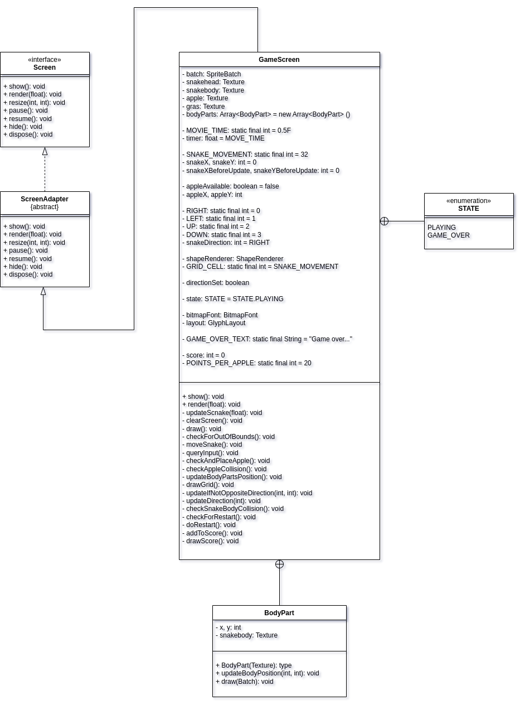

### Snake ###

Simple snake game developed with the Java-Framework GDX.

<i>
<b>Log-History:</b>
  
<table>
<thead>
  <th>Date</th><th>Task</th>
</thead>
<tbody>
  <tr>
    <td>2023-04-05</td><td>Created an empty gdx-project for the game.</td>
  </tr>
</tbody>
</table>
</i>
