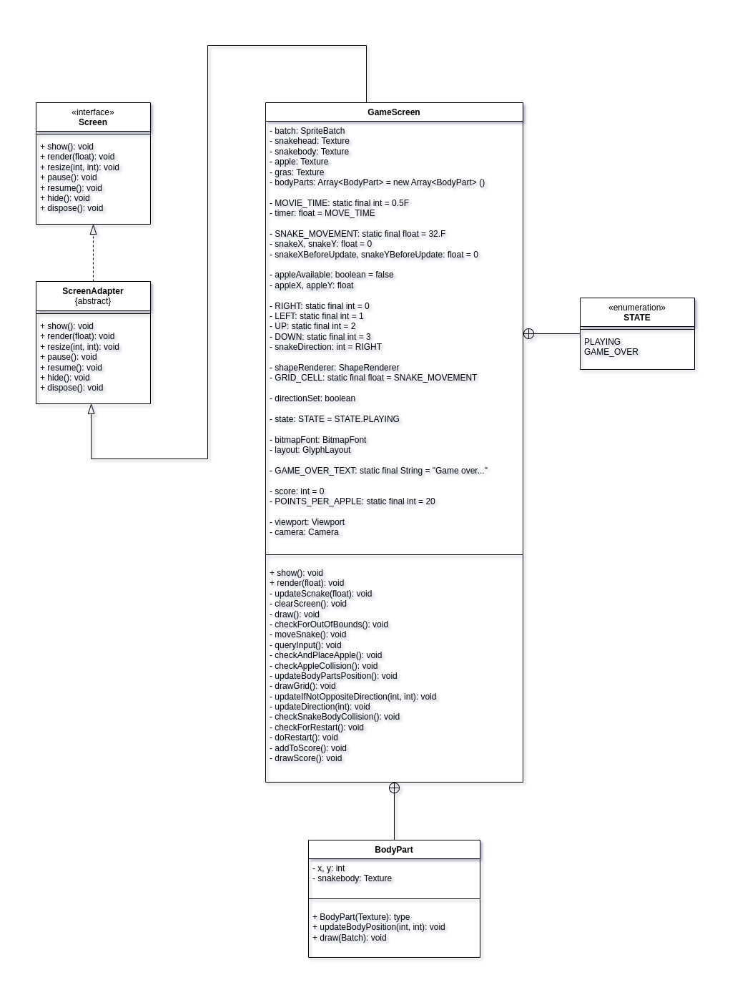

### Snake ###

Simple snake game developed with the Java-Framework GDX.

<ins>___Preview:___</ins>

<ins>___UML-Diagram:___</ins>

<ins>___Log-History:___</ins>

<table>
<thead>
  <th>Date</th><th>Task</th>
</thead>
<tbody>
  <tr>
    <td>2023-04-05</td><td>Created an empty gdx-project for the game. Added Snake, apple and implemented collision detection and snake growth.</td>
  </tr>
  <tr>
    <td>2023-04-06</td><td>Snake body collision, background, highscore, gameover screen added</td>
  </tr>
  <tr>
    <td>2023-04-07</td><td>Viewport and camera implemented, preview of the game</td>
  </tr>
</tbody>
</table>
